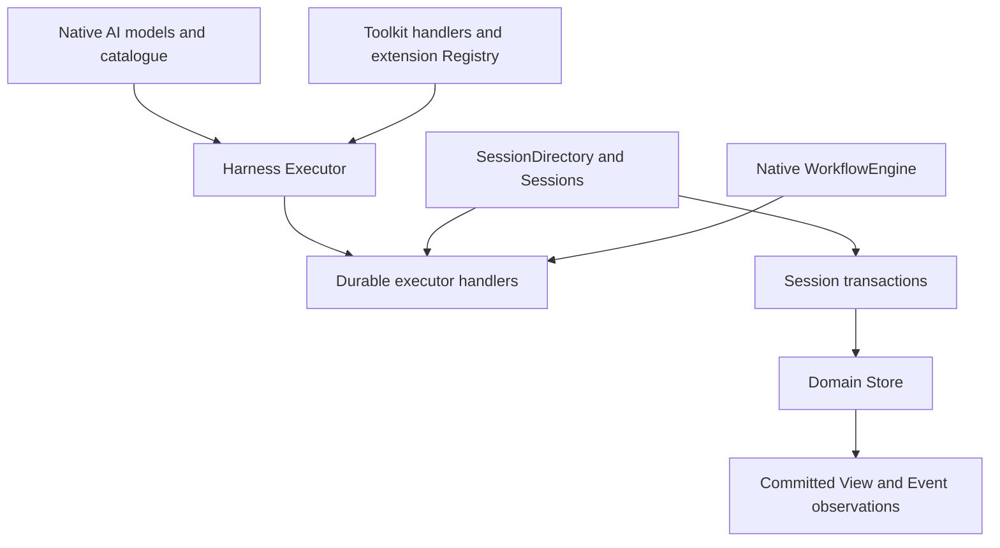

# About composition

Effect Harness separates model/tool execution, committed application facts and durable execution. This explanation connects those boundaries and the service lifetimes they create. It assumes familiarity with Effect Layers; the [Workflow guide](../workflows.md) contains the practical registration steps.

## Three responsibilities

The generic harness resolves a model and extensions, prepares a prompt and executes the resulting model/tool request. Its inputs are a Model.Catalog and Registry. Those describe the application capabilities available to a request.

The durable package records conversations, entries, documents, submissions and owned task state. A Session is the domain boundary over a Store. Its transactions turn candidate mutations into coherent committed facts. A conversation's agent document selects the model and tools for future preparation.

The native WorkflowEngine manages execution identity, Activities, suspension, timers and results. The durable executor Layer registers the built-in handlers with that service. Application Workflows use the same native declarations and handler registration.

This separation lets an application use the generic harness without storing conversation history, or combine domain state with its chosen native execution backend. It also gives provider adapters a bounded job: they construct native models and translate provider-specific request/response behavior.

## Layers establish lifetimes

A Layer does more than name a dependency. Building it captures services and acquires resources in a Scope. Toolkit binding captures handler dependencies; the provider captures its native client; Session construction captures its Store and optional creation initializer.

Reusing a Layer value within one build graph allows memoization to share that acquisition. This matters for a database connection, model transport, Store, Session and mutation-lock manager. Two separately acquired memory Stores represent two sets of facts. Two unrelated mutation managers cannot serialize each other's file writes.

`Layer.provide` satisfies a dependency and hides it from the output. `provideMerge` also retains the provided services. Retaining the engine allows application code to invoke a registered Workflow; retaining the Store allows View and Session to use the same domain state. The chosen composition determines which services remain available to callers.

Config-based constructors are a further Layer selection step. Their options are effectful: configuration must be evaluated before the concrete Layer can be chosen. `Layer.unwrap` connects that Effect of a Layer back to an ordinary Layer, with configuration failures in its error channel.

## Host services and invocation services

Host services are stable for the binding's lifetime: a filesystem environment, application client or credential store. Invocation services identify one request or tool call and carry its scoped reporting callbacks. Capturing the former makes handlers reusable; supplying the latter per call gives each execution its own identity and progress lifetime.

Tool.bind and Hook.bind capture host dependencies and explicitly declare extra request services. For example, an owned durable invocation can supply Ownership.Current, while conversation creation has no running task identity. Treating those contexts as interchangeable would attach work to the wrong lifetime.

## Ownership connects facts to execution

Domain ownership describes which task or conversation is responsible for child work. A saved binding references a native Workflow execution and payload. This gives cancellation, inspection and draining an agreed identity without introducing another scheduling model.

Independent Workflows need ordinary registration. Owned Workflows additionally commit their domain outcome. The distinction is useful: an execution result answers what the engine completed, while a terminal projection records what the owning domain work settled. [Recovery](recovery.md) explains why they may be saved at different moments.

## Choosing a composition

An in-memory engine and Store give fast, disposable execution and are suitable for lessons and isolated tests. Persistent conversations require both native execution history and domain storage. Persisting one does not preserve the other.

SnapshotStore delegates physical persistence and coordination to Effect services. This keeps application database work at the Layer boundary. Its trade-off is a complete retained snapshot rewrite on each commit rather than independently indexed domain tables. JSONL has a smaller backend surface, with a single-writer ownership requirement. The [storage reference](../reference/documents-and-storage.md) records the exact constraints.
