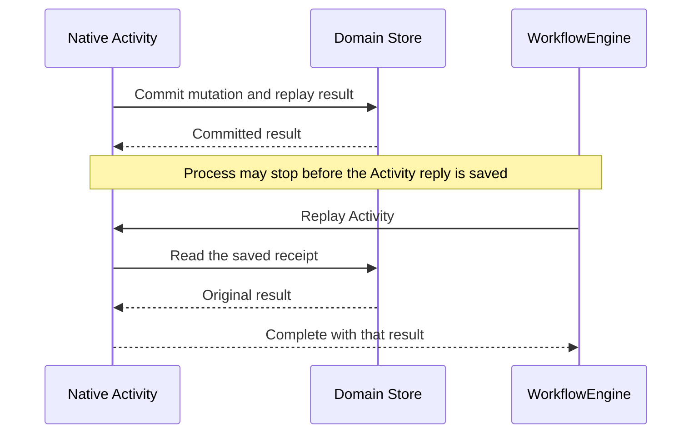

# About replay and recovery

A durable application can stop between any two effects. This explanation follows a conversation request across domain writes, native Activity replies and external actions. It explains the recovery guarantees and their limits; [the persistence guide](../persistence.md) supplies the setup steps.

## A request has several saved facts

A submitted input first gains a stable request identity and domain admission. Generation prepares and pins its prompt/model selection. The provider can then request tools, whose intents and settlements become conversation entries. Final generation settlement records the answer and submission receipt.

Native Workflow execution surrounds those operations with its own saved Activity replies and execution results. The application therefore has two kinds of persistence: domain facts and native execution history. They answer different questions.

## The commit-to-reply gap

An Activity can commit domain state and then lose the process before the native engine saves its return value. Re-executing its mutation blindly would produce a second change even though the first one exists.

Built-in handlers save their complete domain replay result with the mutation. On recovery they check that receipt using the same stable identity. A saved result lets the Activity return what it already committed, allowing native replay to finish its own reply persistence.

This applies to prepared prompts as well as final settlement. A recovered preparation uses the pinned prompt before consulting a changed model selection or rendering sections again. Final settlement recovery restores the same result and continues child draining and notification delivery.

## Identity expresses the intended operation

A submission request ID means "this admission", even when the caller retries after losing a response. Reusing it with changed content retrieves the first same-kind settlement. A transaction key similarly means "this domain update"; its optional fingerprint rejects incompatible reuse.

The application chooses the intended identity before crossing the boundary. A fresh random ID on each retry changes the operation's meaning: it admits more work. A fixed ID reused for unrelated requests instead suppresses intended new work. These are application decisions that persistence cannot infer from text similarity.

Native Workflow IDs, domain Session IDs, provider affinity UUIDs and authorization account keys identify different things. Keeping their contracts separate makes a restart reopen the same facts and execution while still using the intended authorized transport.

## External actions

A database receipt cannot make an arbitrary network, file or process action exactly once. Consider a tool that charges a card: the remote service can accept the charge before the application saves its receipt. After a restart, the local application cannot determine the remote outcome from its own missing receipt alone.

Safe replay means repeating that tool body is acceptable. A pure uppercase transformation meets that condition. A remote operation can also be safe when the remote service enforces a stable idempotency key and returns the original outcome. An operation without that property needs reconciliation or an explicit unsafe policy. Built-in file and shell tools default to unsafe replay.

The trade-off is explicit: automatic re-execution can restore progress, but an unsafe external action may have happened already. Preserving that uncertainty is part of the contract. [Tool policy](../reference/configuration.md#tool-policy) describes the selection controls.

## Failure certainty and observation

A rejected storage candidate never became committed domain truth. An uncertain persistence or coordinator failure means the write may have succeeded. The Store becomes poisoned so subsequent writes cannot assume which candidate is authoritative. Reopening and examining saved receipts restores a basis for reconciliation.

Observers read committed snapshots and frames. A provider token is an external input until saved, while a saved partial response is a domain fact even if the native execution has not finished. Slow observers can reset to current committed state rather than retain every intermediate update. This makes them suitable for a UI that reconnects; an independent audit log has a different retention need.

## Closing and aborting

Scope closure ends a live Session lifetime and pauses recoverable execution. It releases observers, joins handler cleanup and closes backend resources. Reopening can resume the saved work when the engine and declarations remain available.

Abort records a durable cancellation decision. Its committed marks fence late work and connect to live handler cancellation. Owners settle after children and cleanup have been accounted for. Native interruption alone cannot establish that an external action did not happen or that a handler has finished cleaning up.

The two operations serve different application goals: shutdown retains recoverability, while Abort records the decision to cancel domain work. Their precise outcomes are in [execution lifetimes](../reference/execution-and-observation.md#lifetime).
